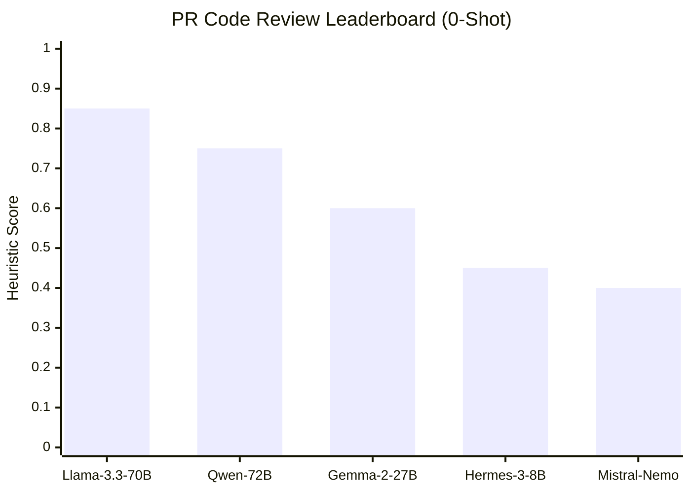
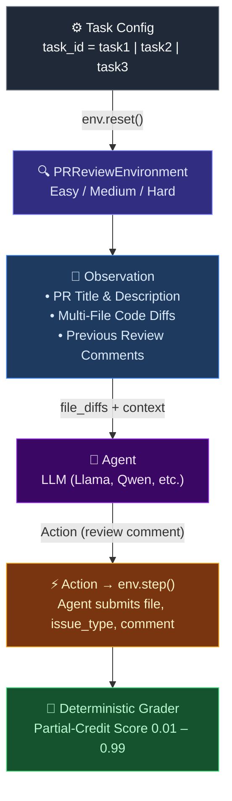

[](https://openenv.dev)
[](https://huggingface.co/spaces)
[](https://python.org)
[](LICENSE)

---

> [!NOTE]
> This is a verified Phase 2 deep-validation submission for the **Meta × HuggingFace × Scaler OpenEnv Hackathon 2026**.

> [!TIP]
> A live deployed version of this environment is available on **HuggingFace Spaces**.

A zero-LLM deterministic OpenEnv reinforcement learning environment evaluating the **code review capabilities** of AI agents against realistic GitHub pull request diffs containing planted bugs, security vulnerabilities, logic errors, and performance issues.



Code review is one of the most important quality gates in software development, yet senior engineers spend **10–15% of their time** reviewing code, with critical security issues frequently slipping through under cognitive load. This environment tests whether an LLM agent can simulate a **Staff Security Engineer**: reading realistic code diffs, identifying bugs across multiple files, and providing actionable fix suggestions — all graded by deterministic heuristic graders with zero-LLM bias.

---

## Quick Start

The simplest way to interact with the environment via Python:

```python
from client import PRReviewEnv
from app.models.schemas import Action, IssueType

with PRReviewEnv(base_url="http://localhost:7860").sync() as env:
    result = env.reset(task_id="task1")
    print(result.observation["pr_title"])

    action = Action(
        file="auth/login.py",
        issue_type=IssueType.SECURITY,
        comment="random.randint is cryptographically weak for token generation",
        suggestion="Use secrets.token_urlsafe() instead",
        done=False,
    )
    result = env.step(action, task_id="task1")
    print(f"Reward: {result.reward}")
```

---

## 💡 Why This Problem?

Automated code review is a frontier challenge that tests multiple dimensions of LLM capability simultaneously:

- **Pattern Recognition** — identifying subtle bugs (missing null checks, off-by-one errors) in realistic code diffs across multiple files
- **Security Expertise** — detecting SQL injection, RCE, path traversal, IDOR, and hardcoded secrets that frequently bypass human review
- **Precision vs Recall** — the agent is **penalised for false positives**, preventing the strategy of flagging everything
- **Multi-File Reasoning** — the hard tier requires cross-referencing 3 separate files to identify 7 interconnected security vulnerabilities

No existing automated benchmark accurately evaluates LLM agents on multi-file code review with partial-credit scoring. **PR Code Review Env** fills this gap with deterministic grading.

---

## 🚀 Try It Now (No Setup Required)

The environment exposes standard OpenEnv HTTP endpoints:

```bash
# Health check
curl -X GET http://localhost:7860/health

# List available tasks with grader info
curl -X GET http://localhost:7860/tasks

# Start an evaluation session
curl -X POST http://localhost:7860/reset \
     -H "Content-Type: application/json" \
     -d '{"task_id": "task1"}'

# Submit an agent action
curl -X POST http://localhost:7860/step \
     -H "Content-Type: application/json" \
     -d '{"task_id": "task1", "action": {"file": "auth/login.py", "issue_type": "security", "comment": "Token uses random.randint which is predictable", "done": false}}'

# Get action/observation JSON schemas
curl -X GET http://localhost:7860/schema
```

---

## Agent Loop Architecture



---

## Tasks & Scenarios

The environment evaluates agents across 3 distinct difficulty tiers:

| Task | Difficulty | PR Scenario | Files | Issues | Core Competency |
|------|-----------|-------------|-------|--------|-----------------|
| `task1` | 🟢 Easy | Auth module bug fixes | 2 | 4 | Identifying obvious bugs: null checks, weak crypto, broken hashing |
| `task2` | 🟡 Medium | E-commerce optimisation | 3 | 4 | Logic + performance: full table scans, breaking changes, memory leaks |
| `task3` | 🔴 Hard | Admin API + data export | 3 | 7 | Multi-file security audit: SQLi, RCE, IDOR, path traversal, secrets |

---

### Action: `Action`

| Field | Type | Required | Description |
|-------|------|----------|-------------|
| `file` | `str` | ✅ | File being commented on |
| `line` | `int \| null` | ❌ | Optional line number |
| `issue_type` | enum | ✅ | `bug / logic / performance / security / style / other` |
| `comment` | `str` | ✅ | Human-readable description of the issue |
| `suggestion` | `str \| null` | ❌ | Optional fix suggestion |
| `done` | `bool` | ✅ | `true` when review is complete |

### Observation: `Observation`

| Field | Type | Description |
|-------|------|-------------|
| `pr_title` | `str` | Title of the pull request |
| `pr_description` | `str` | PR body / description |
| `file_diffs` | `list[FileDiff]` | List of changed files with before/after code and unified diffs |
| `previous_comments` | `list[ReviewComment]` | Comments the agent has already posted this episode |
| `step_count` | `int` | Steps taken so far |
| `max_steps` | `int` | Maximum steps allowed |
| `task_id` | `str` | Active task identifier |

---

## Reward Evaluation (Deterministic Heuristic Graders)

All grading is performed via deterministic keyword matching and heuristic rules (see `app/graders/grader.py`) — **zero LLM-as-a-judge bias**.

Rewards are clipped strictly to `[0.01, 0.99]` for OpenEnv strict boundary validation compliance.

| Event | Step Reward |
|-------|-------------|
| Critical issue correctly found (security, RCE) | **+0.3** |
| Non-critical issue correctly found | **+0.2** |
| False positive (no matching ground truth) | **−0.1** |
| Duplicate (already found this issue) | **−0.05** |

**Episode Score:**
```
score = clamp((correct_found / total_issues) − (false_positives × 0.1), 0.01, 0.99)
```

**Grading Strategies by Tier:**
- **Easy**: Validates keyword extraction against ground-truth with negation filtering
- **Medium**: Fractional credit — 40% root cause, 30% logic errors, 30% performance
- **Hard**: Severity-weighted scoring — critical vulns (SQLi, RCE) weighted higher than informational (debug mode)

---

## Baseline Inference Scores

Evaluation executed via `inference.py` using `meta-llama/Llama-3.1-8B-Instruct` at `TEMPERATURE=0.0`.

| Task | Difficulty | Max Steps | Baseline Score | Notes |
|------|-----------|-----------|---------------|-------|
| `task1` | Easy | 8 | **0.75** | Misses weak email validation |
| `task2` | Medium | 10 | **0.50** | Catches performance issues, misses negative total |
| `task3` | Hard | 12 | **0.43** | Catches SQLi and hardcoded secrets; misses IDOR/path traversal |
| **Average** | — | — | **0.56** | — |

*Note: The inference baseline runs each task in isolated `[START]...[END]` loop blocks as required by the OpenEnv Phase 2 strict stdout protocols.*

```bash
# Run the automated inference loop on all tasks
python inference.py

# Run a specific task
TASK_NAME=task3 python inference.py

# Run multi-model evaluation
python evaluate_models.py
```

---

## Setup

### Local Run
```bash
git clone <repo>
cd openenv
pip install -r requirements.txt
uvicorn server:app --reload --host 0.0.0.0 --port 7860
```

### Docker
```bash
docker build -t pr-review-env .
docker run -p 7860:7860 pr-review-env
```

### Running Inference
```bash
export API_BASE_URL="https://router.huggingface.co/v1"
export MODEL_NAME="meta-llama/Llama-3.1-8B-Instruct"
export HF_TOKEN="hf_your_token_here"

# Optional — connect to deployed HF Space instead of local env
# export ENV_URL="https://your-space.hf.space"

python inference.py
```

### Running Tests
```bash
python -m pytest test_environment.py -v
```

---

## Project Structure

```
openenv-pr-review/
├── app/
│   ├── environment/
│   │   └── env.py              # PRReviewEnvironment (step/reset/state)
│   ├── models/
│   │   └── schemas.py          # Pydantic: Observation, Action, Reward, EpisodeState
│   ├── tasks/
│   │   └── definitions.py      # Task 1/2/3 with realistic diffs and ground truth
│   └── graders/
│       └── grader.py           # Deterministic graders + fuzzy matching + score clamping
├── server/
│   └── app.py                  # OpenEnv server entry point (Web UI + fallback)
├── server.py                   # FastAPI HTTP server (/tasks, /schema, /ws, /step, /reset)
├── client.py                   # Python client library (sync + async)
├── inference.py                # Baseline inference script (multi-task, retry, warmup)
├── evaluate_models.py          # Multi-model evaluation & leaderboard generation
├── test_environment.py         # Comprehensive pytest suite (40+ tests)
├── Dockerfile                  # Container definition (HF Spaces compatible)
├── openenv.yaml                # OpenEnv spec file
├── pyproject.toml              # Python project configuration
├── requirements.txt            # Python dependencies
└── README.md                   # This file
```

---

## HuggingFace Spaces Deployment

1. Push repository to a HF Space with **Docker SDK**
2. Space will build the image and expose port `7860`
3. The OpenEnv endpoints (`/reset`, `/step`, `/tasks`, `/health`, `/ws`) are available immediately
4. The `openenv.yaml` includes the required `openenv` tag for registry compatibility

---

## 🔮 Future Roadmap

To evolve this environment into an enterprise-standard AI benchmark:

- **Dynamic Diff Generation (Anti-Contamination)**: Migrating from static code diffs to procedurally generated PRs that fuzz variable names, function signatures, and vulnerability patterns on every reset to mathematically guarantee zero benchmark memorization.
- **Interactive Multi-Step Review (POMDP)**: Evolving from single-pass review to a multi-round process where agents can request additional file context, run static analysis tools, and ask clarifying questions before finalising their review.
- **Fuzzy Semantic Grading**: Extending the Levenshtein-distance keyword matching with lightweight embedding-based similarity to accommodate LLM vocabulary variance while strictly avoiding LLM-as-a-judge unreliability.
- **Language Expansion**: Expanding beyond Python to JavaScript/TypeScript, Go, Rust, and Java PRs with language-specific vulnerability patterns (prototype pollution, unsafe unwrap, deserialization attacks).
- **Real-World PR Integration**: Connecting to GitHub's API to pull real open-source PRs with known CVEs as evaluation scenarios.

---

## Citation

```bibtex
@software{prcodereviewenv2026,
  title   = {GitHub PR Code Review Environment: Evaluating Foundation Models on Multi-File Code Security Review},
  year    = {2026},
  note    = {Deterministic text-based RL environment for automated code review evaluation}
}
```

---

## License

MIT
